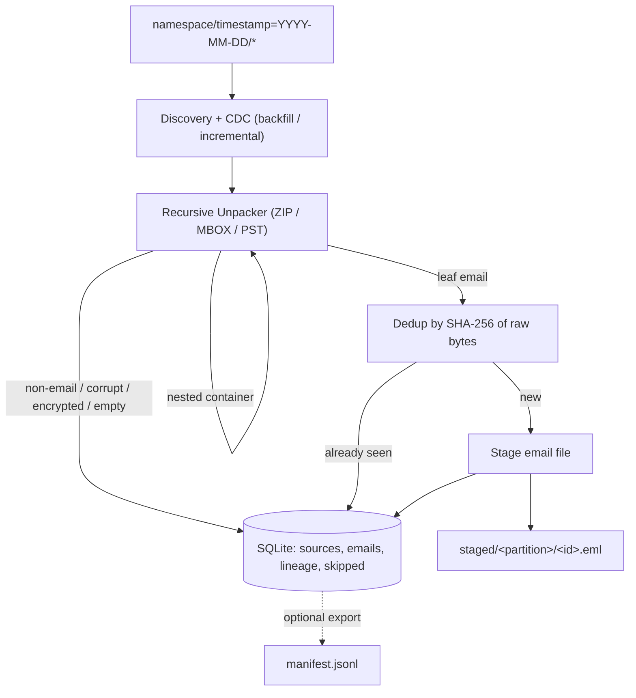

# Email File Ingestion Pipeline

The ingestion head of a data platform: it discovers email files in
date-partitioned directories, recursively unpacks containers (ZIP / MBOX / PST),
deduplicates by content hash, and stages clean individual emails with full
lineage. SQLite is the single source of truth for CDC state, lineage, skipped
files, and the dedup index.

The full design (architecture, unique-id choice, CDC strategy, edge-case
decisions, and production scaling) is in [docs/DESIGN.md](docs/DESIGN.md)
(also available as a [Notion document](https://app.notion.com/p/372f6b6e9b588019ae4ed5e63a8727b6?source=copy_link)).
AI-process notes are in [docs/AI_PROCESS.md](docs/AI_PROCESS.md).

## Setup

The pipeline itself needs only the Python standard library (Python 3.9+).
Tests use `pytest`.

```bash
python3 -m venv .venv
source .venv/bin/activate
pip install -r requirements.txt
```

PST support is optional. Install `libpff-python` to enable it; otherwise PST
files are skipped and recorded with a reason.

## Sample data

The repository ships the assignment's provided fixtures under `test_data/`, so
you can run the pipeline immediately. The ten edge-case fixtures are built
programmatically by the test suite (`tests/fixtures_builder.py`) and exercised by
the tests. To also materialize the full bucket (provided + edge-case fixtures) on
disk for a manual run, use the generator:

```bash
python scripts/generate_test_data.py test_data
```

This writes the provided fixtures plus the edge-case fixtures (nested ZIPs,
colliding inner names, password-protected ZIP, corrupt ZIP, non-email files,
empty containers, duplicates across partitions) under `test_data/`.

## Run

```bash
# Backfill: process everything (run once at onboarding)
python -m pipeline run --namespace namespace_a --mode backfill \
    --bucket ./test_data --out ./output

# Incremental: process only new/unprocessed sources (the 15-minute cron)
python -m pipeline run --namespace namespace_a --mode incremental \
    --bucket ./test_data --out ./output
```

Outputs land under `--out`:

- `staged/<partition>/<id>.eml` - the deduplicated individual emails.
- `state.db` - SQLite source of truth (sources, emails, lineage, skipped).
- `manifest.jsonl` - optional export for downstream consumers, one JSON object
  per staged email: `email_id`, `partition`, `staged_path`, and `lineage`.

Backfill over the provided `test_data/` prints:

```
sources_processed=5 emails_staged=8 duplicates=0 files_skipped=0
```

A second run in `--mode incremental` reprocesses nothing
(`sources_processed=0`), demonstrating CDC + idempotency.

## Test

```bash
python -m pytest            # 16 tests: unit + end-to-end + edge cases + crash-restart
```

See [Edge cases & tests](#edge-cases--tests) for the edge-case-to-test mapping.

## Design Document

The full design — with illustrative code/SQL — lives in
[docs/DESIGN.md](docs/DESIGN.md) (also a
[Notion copy](https://app.notion.com/p/372f6b6e9b588019ae4ed5e63a8727b6?source=copy_link)).
The essentials are summarized here.

### Architecture overview



Discovery walks date partitions and applies CDC; each file flows through a
recursive unpacker; leaf emails are deduped by content hash and staged; all
facts (emails, lineage, skips, source status) are committed to SQLite per source.

### Unique identifier — and why

The id is the **SHA-256 of the leaf email's raw bytes** (computed *after*
unpacking). It's content-addressed, so it is correct for the "two containers
both emit `001.eml`" case (different bytes → different id) and collapses truly
identical copies into one staged file with multiple lineage rows. A separate
`source_hash` (SHA-256 of the *source* file) is the CDC identity:

- `source_hash` answers "have I already processed this source file?"
- `content_hash` answers "have I already seen this email?"

Details: [Deduplication](docs/DESIGN.md#deduplication),
[Source identity (CDC)](docs/DESIGN.md#source-identity-cdc).

### CDC strategy (backfill vs incremental)

- **Backfill** processes every source (run once at onboarding).
- **Incremental** skips sources already recorded `processed` in SQLite (the
  15-minute cron). State is persistent and updates are transactional, so a crash
  never causes reprocessing or loss. Details:
  [Phase 1](docs/DESIGN.md#phase-1-p0---discovery-cdc-and-staging).

### How unpacking and dedup interact

Containers are expanded with an **explicit worklist** (not recursion), so
`ZIP → ZIP → MBOX → emails` unrolls uniformly, bounded by depth/expansion guards
(zip-bomb protection). Dedup runs on the **leaf bytes after all unpacking**, which
is what makes identical-inner-name and identical-content cases correct. Details:
[Phase 2](docs/DESIGN.md#phase-2-p0---recursive-container-unpacking-and-dedup).

### What changes for production scale

Object store (S3/GCS) + Postgres instead of local FS + SQLite (same `content_hash`
keying); discovery enqueues sources to a queue with stateless sharded workers;
streaming extraction for large archives; dead-letter quarantine for poison-pill
sources; per-tenant dedup scope and quotas. Details:
[Production notes](docs/DESIGN.md#production-notes).

### Scope decisions & edge cases

- **Scope decisions** (implemented / deferred / why):
  [Scope Decisions](docs/DESIGN.md#scope-decisions).
- **Edge case decisions** (all 10, behavior + rationale):
  [Edge Case Decisions](docs/DESIGN.md#edge-case-decisions).

AI-process notes: [docs/AI_PROCESS.md](docs/AI_PROCESS.md).

## Edge cases & tests

All ten assignment edge cases have automated coverage
(`tests/test_pipeline.py`, `tests/test_units.py`):

| # | Edge case | Behavior | Test |
|---|-----------|----------|------|
| 1 | Same filename, different partitions | Both kept (different bytes) | `test_same_filename_different_partitions` |
| 2 | ZIP containing a ZIP | Fully unrolled | `test_deeply_nested_chain` |
| 3 | Identical inner names, different bytes | Kept distinct | `test_identical_inner_names_kept_distinct` |
| 4 | Password-protected ZIP | Skip, `encrypted_zip` | `test_skip_reasons_recorded` |
| 5 | Corrupted ZIP | Skip, `corrupt_zip` | `test_skip_reasons_recorded` |
| 6 | Non-email files (`.png`, `.xlsx`) | Skip, `non_email` | `test_skip_reasons_recorded` |
| 7 | Empty container | Skip, `empty_container`; source done | `test_skip_reasons_recorded` |
| 8 | Crash mid-run + restart | Resume; no dupes, no loss | `test_crash_midrun_then_restart_no_duplicates` |
| 9 | Re-upload to same partition across runs | Deduped, no second copy | `test_reupload_same_partition_across_runs_is_deduped` |
| 10 | Deep chain ZIP→ZIP→MBOX→emails | Unrolled to `MAX_DEPTH`, else `depth_exceeded` | `test_deeply_nested_chain`, `test_depth_guard_records_skip` |

Identical-content collapse (one email, two lineages) is additionally covered by
`test_identical_content_collapses_with_multiple_lineages`.

## Layout

```
pipeline/
  classify.py    # format/container classification
  unpack.py      # recursive worklist unpacker + guards
  stage.py       # content-hash dedup + staging
  store.py       # SQLite source of truth
  pipeline.py    # discovery + CDC orchestration
  manifest.py    # optional manifest export
  __main__.py    # CLI
tests/           # unit + end-to-end + edge-case + crash-restart tests
scripts/         # test-data generator
docs/            # DESIGN.md, AI_PROCESS.md
```
