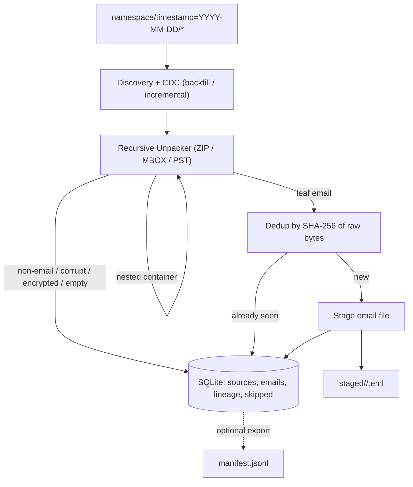

# Email File Ingestion Pipeline - Technical Design Doc

## Context

This is the ingestion head of a data platform. Customers drop email files into cloud storage, organized by date partitions. Our job is to turn that raw input into a clean, deduplicated set of individual email files that downstream normalization can consume, with full traceability back to the source.

The pipeline does four things:

- Discover files in date-partitioned directories.
- Unpack containers (ZIP, MBOX, PST), including nested ones, to surface the emails inside.
- Deduplicate so the same email is never processed twice, within a run or across runs.
- Stage the resulting emails and record their lineage and any files that were skipped.

Environment for this take-home:

- "Cloud storage" is the local filesystem (the bucket is a directory tree).
- State is SQLite. It is the single source of truth for CDC state, lineage, skipped files, and the dedup index.
- Language is Python.

Scope note: the assignment is time-boxed (1-3 hours), so this doc is split into phases. P0 is a correct end-to-end pipeline for the provided fixtures, including nested containers and dedup. P0 keeps each email intact as-is, including its embedded attachments. Separate attachment extraction and production scaling are P1. Snippets below are illustrative; they show the design, not a finished implementation.

---

## Flow Diagram and Description



Walkthrough:

1. Discovery + CDC. We walk `<namespace>/timestamp=YYYY-MM-DD/` partitions. Backfill mode considers every file; incremental mode considers only sources not already recorded as done in SQLite. State is persistent and updates are transactional, so a crash never causes reprocessing or loss.
2. Recursive unpacking. Each file is classified. EML/HTML/MSG are leaves; ZIP/MBOX/PST are expanded and their children fed back through the same classifier via a worklist, so ZIP -> ZIP -> MBOX -> emails unrolls naturally. Depth and expansion guards protect against zip bombs.
3. Dedup. Each leaf email is identified by the SHA-256 of its raw bytes. If that hash already exists in SQLite, we record another lineage row and skip the write; otherwise we stage it.
4. Stage. New emails are written to `staged/<partition>/<id>.eml` and all facts (email row, lineage, skip reasons) are committed to SQLite in one transaction.

---

## Phases

### Phase 1 (P0) - Discovery, CDC and Staging

Objective: a correct end-to-end pipeline over the provided fixtures, with durable, crash-safe state. Emails are staged intact (embedded attachments stay inside the email file).

- Partition scan: enumerate `<namespace>/timestamp=YYYY-MM-DD/` and the files inside.
- CDC modes:
  - Backfill: process all partitions (run once at onboarding).
  - Incremental: process only sources not already recorded done in SQLite (the 15-minute cron).
- Single-file staging for EML / HTML / MSG.
- Content-hash id, lineage, and skip reasons, all persisted to SQLite.

```python
def run(namespace: str, mode: str = "incremental") -> RunSummary:
    for partition in discover_partitions(namespace):
        for source in list_sources(namespace, partition):
            if mode == "incremental" and store.is_processed(source.source_path, source.source_hash):
                continue
            try:
                for leaf in expand(source):     # leaf -> stage; container -> unpack (Phase 2)
                    stage(leaf)
                store.mark_processed(source.source_path, source.source_hash)   # same txn as staging
            except UnreadableSource as e:
                store.record_skip(source, reason=str(e))
    return store.run_summary()
```

Crash safety: staging an email and marking its source done happen in one SQLite transaction. If a crash happens before the transaction commits, the source is simply retried on the next run. If some email files were already written to disk before the crash, the content-hash/idempotent writes recognize them and skip rewriting, so retrying produces no duplicates. Email files are written using deterministic paths derived from the content hash. If a crash occurs after a file is written but before the SQLite transaction commits, reprocessing the same email will resolve to the same target path and remain idempotent.

### Phase 2 (P0) - Recursive Container Unpacking and Dedup

Objective: handle containers of arbitrary nesting, dedup correctly, and preserve full lineage.

Recursive unpacker using an explicit worklist (no unbounded recursion):

```python
def expand(source: Blob) -> Iterator[LeafEmail]:
    work = deque([(source, source.lineage, 0)])
    expansions = 0
    while work:
        blob, chain, depth = work.popleft()
        kind = classify(blob)            # eml/html/msg | zip | mbox | pst | unknown
        if kind in LEAF_KINDS:
            yield LeafEmail(blob, chain)
        elif kind in CONTAINER_KINDS:
            guard_depth(depth)                          # zip-bomb guard
            for child, segment in open_container(blob, kind):   # may raise Encrypted/Corrupt/Empty
                expansions += 1
                guard_expansion(expansions)
                work.append((child, chain.append(segment), depth + 1))
        else:
            store.record_skip(blob, chain, reason="non_email")
```

Lineage: each child appends a segment to an ordered chain. `!` separates container hops and `#` indexes messages inside an MBOX/PST, for example:

```
namespace_a/timestamp=2024-07-15/archive.zip!nested.zip!mailbox.mbox#3
```

It is stored as a readable string plus structured rows in SQLite pointing at the staged email id.

PST containers are parsed using a dedicated PST parser library (for example pypff/libpff). If PST parsing support is unavailable or the file cannot be parsed, the source is skipped and recorded with an appropriate reason.

Dedup: the content hash is computed on the leaf email bytes after all unpacking. This is what makes the "two MBOXes both emit 001.eml" case correct: same name but different bytes means different hashes, so both are kept; truly identical bytes collapse to one staged file with two lineage rows.

```python
def stage(leaf: LeafEmail) -> None:
    content_hash = sha256(leaf.bytes)               # the unique id
    if store.email_exists(content_hash):
        store.add_lineage(content_hash, leaf.lineage)   # dedup: keep provenance, skip write
        return
    path = write_email(partition=leaf.partition, email_id=content_hash, data=leaf.bytes)
    store.record_email(content_hash, path, leaf.partition, leaf.lineage)   # one txn
```

### Phase 3 (P1, design only) - Attachments, Scale and Hardening

Not implemented in the take-home; described in [Production notes](#production-notes).

- Separate attachment extraction (write attachments alongside the parent email and index them).
- Parallel workers with a durable queue.
- Object storage and Postgres instead of local FS and SQLite.
- Streaming extraction for large archives.
- Dead-letter quarantine for poison-pill sources.

---

## API / Interface Design

This is a batch pipeline, so the interface is a CLI plus on-disk schemas.

```bash
# Backfill (once, at onboarding)
python -m pipeline run --namespace namespace_a --mode backfill --bucket ./test_data --out ./output

# Incremental (every 15 minutes)
python -m pipeline run --namespace namespace_a --mode incremental --bucket ./test_data --out ./output
```

SQLite is the source of truth:

```sql
CREATE TABLE sources (
  source_path   TEXT NOT NULL,
  source_hash   TEXT NOT NULL,      -- sha256 of source bytes (see Source identity)
  namespace     TEXT NOT NULL,
  partition     TEXT NOT NULL,
  status        TEXT NOT NULL,      -- pending | processed | skipped
  updated_at    TEXT NOT NULL,
  PRIMARY KEY (source_path, source_hash)
);

CREATE TABLE emails (
  content_hash  TEXT PRIMARY KEY,   -- sha256 of leaf email bytes (the unique id)
  partition     TEXT NOT NULL,
  staged_path   TEXT NOT NULL,
  created_at    TEXT NOT NULL
);

CREATE TABLE lineage (
  content_hash  TEXT NOT NULL REFERENCES emails(content_hash),
  chain         TEXT NOT NULL,      -- full lineage string
  PRIMARY KEY (content_hash, chain)
);

CREATE TABLE skipped (
  source_path   TEXT NOT NULL,
  chain         TEXT,
  reason        TEXT NOT NULL,      -- non_email | corrupt_zip | encrypted_zip | empty_container | depth_exceeded
  created_at    TEXT NOT NULL
);
```

`manifest.jsonl` is generated from SQLite only for downstream consumption; SQLite remains the source of truth:

```json
{"email_id":"a1b2...","partition":"2024-07-15","staged_path":"staged/2024-07-15/a1b2.eml","lineage":["namespace_a/timestamp=2024-07-15/batch.zip!invoice.eml"]}
```

---

## Deduplication

- Take-home: SHA-256 of the raw email bytes. Simple, deterministic, and correct for the fixtures, including identically named files from different containers.
- Production: the email `Message-ID` header can be used as an additional signal, but normalized content hashing (canonical headers + body) is a stronger deduplication signal than Message-ID alone, since Message-ID can be missing, duplicated, or forged. Raw-byte hashing is the conservative default but treats any byte-level difference as a distinct email.

---

## Source identity (CDC)

A source needs a stable identity so incremental runs skip what is already done.

- Avoid relying only on `path + size + mtime`. mtime is fragile (re-uploads, clock skew, copies preserve or reset it inconsistently), and size collisions are common.
- Prefer `source_path + source_hash`. Hashing the source bytes gives a true identity: a re-upload of the same file is recognized even if mtime changed, and a changed file is correctly re-detected.
- Two related but distinct hashes: the `source_hash` is used for CDC/source-level idempotency (have we already processed this source object?), while the email `content_hash` is used for deduping individual leaf emails after unpacking. A single source can yield many emails, so these operate at different levels. In short:
  - `source_hash` answers: "Have I already processed this source file?"
  - `content_hash` answers: "Have I already seen this email?"
- Tradeoff for large files: hashing every source on every incremental scan is expensive. Practical compromise: use a cheap pre-filter (path + size + mtime) to find candidates, then confirm with a content hash before deciding. At larger scale, store the hash and only recompute when the cheap signals change.
- For the take-home, hashing source files is acceptable and keeps the design simple. At production scale, repeatedly hashing very large files can become expensive, so object version IDs, ETags, storage events, or event-driven ingestion would typically be preferred.

---

## Integration

- Downstream (normalization): consumers read `staged/<partition>/` for email bytes and query SQLite (or the exported `manifest.jsonl`) for id, lineage, and partition. The schema is the contract; the on-disk layout can change behind it.
- Upstream (the bucket): files can arrive in a partition at any time and a partition can receive multiple uploads. We are not told when a customer finishes uploading, which is why incremental scans repeat.
- Operations: backfill runs once per customer at onboarding; the incremental job is scheduled (cron / Airflow / k8s CronJob) every 15 minutes.

---

## Edge Case Decisions

| # | Edge case | Behavior | Rationale |
|---|-----------|----------|-----------|
| 1 | Same filename in different partitions | Both kept if bytes differ; identical bytes collapse to one email with both lineages | Id is content hash, not name/path |
| 2 | ZIP containing a ZIP containing emails | Fully unrolled via worklist | Children handled uniformly |
| 3 | Two MBOXes both emitting 001.eml | Treated as distinct emails | Different bytes -> different hash |
| 4 | Password-protected ZIP | Skip, reason=encrypted_zip | No credentials; surface, do not crash |
| 5 | Corrupted ZIP | Skip, reason=corrupt_zip; partition continues | One bad container must not fail the run |
| 6 | Non-email files (.png, .xlsx) | Skip, reason=non_email | Classifier returns unknown |
| 7 | Empty container | Mark source done, reason=empty_container, nothing staged | Not an error |
| 8 | Crash mid-run then restart | Resume; no reprocessing, no loss | Transactional state + content-hash idempotency |
| 9 | Same file re-uploaded to same partition | Detected and skipped | Source identity and content hash both catch it |
| 10 | Deep chain ZIP -> ZIP -> MBOX -> emails | Unrolled up to MAX_DEPTH, else skip reason=depth_exceeded | Correct for real nesting, safe against zip bombs |

Note on attachments (P0): emails are staged intact, so embedded attachments are preserved inside the email file. Extracting them as separate, indexed artifacts is P1.

---

## Production notes

Short version of what changes beyond the take-home:

- Storage and state: object store (S3/GCS) for files, Postgres for the metadata that SQLite holds here, keyed the same way (`content_hash`).
- Parallelism: discovery enqueues sources to a queue (SQS/Kafka); stateless workers unpack and stage, sharded by partition or hash prefix.
- Large archives: stream extraction and spill to scratch disk instead of loading whole archives into memory; cap per-archive expansion and time.
- Attachments: extract and store separately, linked to the parent email id.
- Reliability: dead-letter sources that fail repeatedly so one bad file cannot wedge a partition.
- Multi-customer: namespace maps to tenant, with per-tenant quotas and dedup scope.

---

## QA / Testing Strategy

- Fixtures to add (one per edge case): nested ZIPs, two MBOXes with colliding inner names, a password-protected ZIP, a corrupted ZIP, mixed non-email files, an empty ZIP/MBOX, and a duplicate file across partitions.
- Unit tests: classifier, content-hash id, lineage chain, dedup decision, guard trips.
- Integration test: full `run()` over `test_data/` asserting the exact set of staged ids, lineages, and skip reasons.
- Crash-restart test: inject an exception after staging but before commit, then assert no duplicates and no lost emails on the next run.
